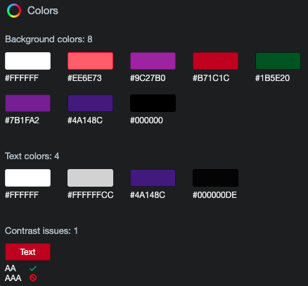

# The Bar Blade


[Here is a link to the final project](https://ms3-the-bar-blade.herokuapp.com/homepage)

This is a cocktail recipe site, built for bartenders, by bartenders. It's a site where users can sign in, find cocktails, add their own cocktails, and edit or delete old cocktail recipes. It is designed to be responsive on a wide range of devices, whilst also being easy to navigate through. 


## Contents

* [User Experience (UX)](#user-experience-(ux))
    * [Initial Discussion](#initial-discussion)
    * [User Stories](#user-stories)
    * [Project goals](#project-goals)

* [Design](#design)
    * [Color Scheme](#color-scheme)
    * [Typography](#typography)
    * [Imagery](#imagery)
    * [Wireframes](#wireframes)
    * [Features](#features)
    * [Audio](#audio)

* [Technologies Used](#technologies-used)
    * [Languages Used](#languages-used)
    * [Frameworks, Libraries & Programs Used](#frameworks-libraries-and-programs-used)

* [Deployment](#deployment)
    * [Initial Deployment](#initial-deployment)
    * [How to Fork it](#how-to-fork-it)
    * [How to Clone it](#how-to-clone-it)
    * [Making a Local Clone](#making-a-local-clone)

* [Testing](#testing)
    * [W3C Validator](#w3c-validator)
    * [Testing User Stories](#testing-user-stories)
    * [Full Testing](#full-testing)
    * [Solved Bugs](#solved-bugs)
    * [Known Bugs](#known-bugs)
    * [Lighthouse](#lighthouse)
        * [Performance](#performance)
        * [Accessibility](#accessibility)
        * [Best Practices](#best-practices)
        * [SEO](#seo)

* [Credits](#credits)
    * [Code](#code)
    * [Content](#content)
    * [Media](#media)
    * [Acknowledgements](#acknowledgements)

---
## User Experience (UX)
### Initial Discussion
I wanted to create a website linked to a database, which allows users to login, add their own cocktails, or just search and find previously added cocktails. As an ex-bartender myself, this was something I always wanted but couldn't find online.

### User Stories
#### First Time Visitor Goals
* To be able to easily navigate the site.
* It should be easy to understand what to do.
* It should be easy to register for an account.

#### Returning Visitor Goals
* It should be easy to add, edit and delete the user's cocktails.
* It should be easy to see the cocktails the user has added.
* The user's password should be stored securely.

#### Frequent Visitor Goals
* Other users shouldn't be able to edit or delete the user's cocktails.
* A user shouldn't be able to brute force their way into the restricted pages.

### Project Goals
* This project has the goal of demonstrating my understanding of maintaining a database attached to a website, with full CRUD (Create, Read, Update and Delete) functionality.

---
## Design
### Color Scheme
* I decided on a very simple theme of purple and black for my color scheme.
* I didn't want to distract from the content of the site, hence choosing two main colours.
* I have used 3 different shades of purple to provide some contrast.
* All text is white, which allows the text to be easily visible on all backgrounds.
* I have used red only for the delete buttons, to convey the button is a destructive thing.


### Typography
* I have used a barcode-style font from Google Fonts, called Libre Barcode 128 Text, to form the logo. This has the fallback font of sans-serif.
* I have used a cursive font from Google Fonts, called Dancing Script, to link with the theme of an elegant cocktail bar. This has the fallback font of cursive.
* The basic font-family of Arial, Helvetica, sans-serif has been used for the rest of the text, so as to not distract the user from the content of the site. This also comes with the bonus that it's standard with HTML, so it should render on any browser and any device.

### Imagery
* The images used in this project are all pictures of cocktails, to match the recipes.
* Icons are used where suitable to allow users to easily understand at a glance what is intended.

### Wireframes
[Here are the wireframes for desktop, mobile and tablet for this project](static/docs/wireframes.pdf).

### Features
* WHAT FEATURES ARE ONE THE SITE, LIKE SCOREBOARD, FUNCTIONS, SCROLLING ALERT BAR, ETC.

### Audio
* No audio is used in this project.
---

## Technologies Used
### Languages Used
* [HTML5](https://developer.mozilla.org/en-US/docs/Web/Guide/HTML/HTML5)
* [CSS3](https://developer.mozilla.org/en-US/docs/Archive/CSS3#:~:text=CSS3%20is%20the%20latest%20evolution,flexible%20box%20or%20grid%20layouts.)
* [JavaScript](https://developer.mozilla.org/en-US/docs/Web/JavaScript)
* [Python](https://www.python.org/)

### Frameworks Libraries and Programs Used
#### Git:
[Git](https://git-scm.com/) was used for version control by utilizing the Gitpod terminal to add and commit to Git and push to GitHub.
#### GitHub:
[GitHub](https://github.com/) is used to store the code for this project after being pushed from Git.
#### Balsamiq:
[Balsamiq](https://balsamiq.com/) was used to create the wireframes during the design process.
#### Responsinator:
[Responsinator](http://www.responsinator.com/) was used to help improve the responsive design on a variety of devices.
#### Google DevTools:
[Google DevTools](https://developer.chrome.com/docs/devtools/) was used to help find what code correlated to which feature.
#### Am I Responsive Design:
[Am I Responsive Design](http://ami.responsivedesign.is/#) was used to check the responsive design of the site, and to create the final site image.
#### Shields.io:
[Shields.io](https://shields.io/) was used to create the GitHub badges for the top of this README.md file.
#### Lighthouse:
[Lighthouse](https://developers.google.com/web/tools/lighthouse) was used to ensure that the code was as performant as possible, confirming to best practices, and SEO and Accessibility guidelines.
#### Font Awesome:
[Font Awesome](https://fontawesome.com/) was used on all pages to add the icons.
#### Autoprefixer CSS online
[Autoprefixer CSS online](https://autoprefixer.github.io/) was used to ensure all prefixes for browsers were included correctly.
#### MongoDB:
[MongoDB](https://www.mongodb.com/) was used to store the contents of the database, and allow full CRUD functionality.
#### Flask:
[Flask](https://flask.palletsprojects.com/en/2.0.x/) was used to help create the templating for this site.
#### Materialize:
[Materialize](https://materializecss.com/) was used to create a beautiful, responsive website.
#### jQuery:
[jQuery](https://jquery.com/) was used to make the DOM traversal easier within the JavaScript.
#### Google Fonts:
[Google Fonts](https://fonts.google.com/) was used to select all the fonts on the site.

## Deployment
### Initial Deployment
This site was deployed to GitHub Pages by following these steps:
1. Login or Sign Up to [GitHub](www.github.com).
2. Create a new repository named "ms3-the-bar-blade".
3. Once created, click on "Settings" on the navigation bar under the repository title.
4. Scroll down to "GitHub Pages".
5. Under "Source", choose which branch to deploy. I chose "master", but this is sometimes shown as "main".
6. Choose which folder to deploy from, usually "/root".
7. Click "Save", then wait for it to be deployed. It can take some time for the page to be fully deployed.
8. Your URL will be displayed above "Source".

### How to Fork it
1. Login or Sign Up to [GitHub](www.github.com).
2. On GitHub, go to [Abibubble/ms3-the-bar-blade](https://github.com/Abibubble/ms3-the-bar-blade).
3. In the top right, click "Fork".

### How to Clone it
1. Login or Sign Up to [GitHub](www.github.com).
2. Fork the repository Abibubble/ms3-the-bar-blade using the steps above in [How to Fork it](#how-to-fork-it).
3. Above the file list, click "Code".
4. Choose if you want to clone using HTTPS, SSH, or GitHub CLI, then click the copy button to the right.
5. Open Git Bash.
6. Change the directory to where you want your clone to go.
7. Type git clone and then paste the URL you copied in step 4.
8. Press Enter to create your clone.

### Making a Local Clone
1. Log in to [GitHub](www.github.com) and locate the [Repository](https://github.com/Abibubble/ms3-the-bar-blade) for this site.
2. Under the repository name, above the list of files, click "Code".
3. Here you can either Clone or Download the repository.
4. You should clone the repository using HTTPS, clicking on the icon to copy the link.
5. Open Git Bash.
6. Change the current working directory to the new location, where you want the cloned directory to be.
6. Type git clone, and then paste the URL that was copied in Step 4.
7. Press Enter, and your local clone will be created.

For a more detailed version of these steps, go to the [Github Docs](https://docs.github.com/en/github/creating-cloning-and-archiving-repositories/cloning-a-repository#cloning-a-repository-to-github-desktop) page on this topic.

---
## Testing
### W3C Validator
The W3C Markup Validator, W3C CSS Validator and JSHint were used to validate the project to ensure there were no syntax errors within the site.

1. W3C Markup Validator
    * [HTML Results](LINK)

2. W3C CSS Validator
    * [CSS Results](LINK)

3. JSHint
    * [JSHint](https://jshint.com/)


### Testing User Stories
#### First Time Visitor Goals
##### To be able to easily navigate the site.
* 

##### It should be easy to understand what to do.
* 

##### It should be easy to register for an account.
* 

#### Returning Visitor Goals
##### It should be easy to add, edit and delete the user's cocktails.
* 

##### It should be easy to see the cocktails the user has added.
* 

##### The user's password should be stored securely.
* 

#### Frequent Visitor Goals
##### Other users shouldn't be able to edit or delete the user's cocktails.
* 

##### A user shouldn't be able to brute force their way into the restricted pages.
* 

### Project Goals
##### This project has the goal of demonstrating my understanding of maintaining a database attached to a website, with full CRUD (Create, Read, Update and Delete) functionality.
* 

### Full Testing
[Click here](static/docs/TESTING.md) to view the full testing steps that were completed on every device and browser, and screenshots of testing.

### Solved Bugs
1. When I added the confirm deletion modal into categories.html, it wasn't taking the category I'd clicked on to delete, it was just deleting the first category in the list.
    * I looked through my code on Google DevTools and saw that, as my delete button was part of a for loop that was populating categories, it was also duplicating the ID of the modal.
    * This meant that when it came to deleting, it didn't know which one of those IDs I actually wanted to delete.
    * I then added in the ```category._id```, so I could have an individual ID for each category.
    * This solved the bug, and also fixed the issue that W3C HTML validator brought up about repeated IDs.

### Known Bugs
* ANY BUGS LEFT IN THE CODE AFTER FINAL DEPLOYMENT, FOR FIXING IN FUTURE RELEASES

### Lighthouse
I tested my website using DevTools Lighthouse feature, and got these results:

#### Desktop


#### Mobile


#### Performance:
* EXPLAIN SCORE AND HOW I IMPROVED IT IF NECESSARY

#### Accessibility:
* EXPLAIN SCORE AND HOW I IMPROVED IT IF NECESSARY
* All colors are WCAG AA compliant.
SCREENSHOT OF AA COLOR COMPLIANCE FROM DEVTOOLS

#### Best Practices:
* EXPLAIN SCORE AND HOW I IMPROVED IT IF NECESSARY

#### SEO:
* EXPLAIN SCORE AND HOW I IMPROVED IT IF NECESSARY

---
## Credits
### Code
* [Font Awesome](https://fontawesome.com/): Library of icons used for social media and download links.
* [Autoprefixer CSS online](https://autoprefixer.github.io/): To aid in the CSS prefixing.
* [Materialize](https://materializecss.com/): To create a beautiful responsive site, without taking too much time.
* [Code Institute](https://codeinstitute.net/): For the select form element validation

### Content
* Unless otherwise mentioned, all code and content was created by [Abi Harrison](https://github.com/Abibubble).

### Media
* Screwdriver - Photo by [Gerhard G.](https://pixabay.com/users/blende12-201217/?utm_source=link-attribution&amp;utm_medium=referral&amp;utm_campaign=image&amp;utm_content=2029118) from Pixabay.
* Long Island Iced Tea - Photo by [Robert Krajewski](https://pixabay.com/users/robert84ak-16722616/?utm_source=link-attribution&amp;utm_medium=referral&amp;utm_campaign=image&amp;utm_content=5374802) from Pixabay.
* Negroni - Photo by [Isabella Mendes](https://www.pexels.com/@isabella-mendes-107313) from Pexels.
* Godfather - Photo by [Marta Dzedyshko](https://www.pexels.com/@marta-dzedyshko-1042863) from Pexels.
* Mojito - Photo by [StockSnap](https://pixabay.com/users/stocksnap-894430/?utm_source=link-attribution&amp;utm_medium=referral&amp;utm_campaign=image&amp;utm_content=698499) from Pixabay.
* Sex on the beach - Photo by [Geraud pfeiffer](https://www.pexels.com/@geraud-pfeiffer?utm_content=attributionCopyText&utm_medium=referral&utm_source=pexels) from Pexels
* Bellini - Photo by [Sabel Blanco](https://www.pexels.com/@sabel-blanco-662810?utm_content=attributionCopyText&utm_medium=referral&utm_source=pexels) from Pexels
* Aperol - Photo by [Kristina Paukshtite](https://www.pexels.com/@kpaukshtite?utm_content=attributionCopyText&utm_medium=referral&utm_source=pexels) from Pexels
* Shirley Temple - Photo by [Tim Douglas](https://www.pexels.com/@tim-douglas?utm_content=attributionCopyText&utm_medium=referral&utm_source=pexels) from Pexels
* Fuzzy Navel - Image by [Sergej Cankov](https://pixabay.com/users/webarts-578779/?utm_source=link-attribution&amp;utm_medium=referral&amp;utm_campaign=image&amp;utm_content=4199127) from Pixabay

### Acknowledgements
* My mentor, Antonio Rodriguez, at [Code Institute](https://codeinstitute.net/), for continuous helpful feedback and support.
* [Eve Crabb](https://github.com/evecrabb), for her support through my learning, and for being a sounding board for bug fixes.
* [Tom Crabb](https://github.com/tomcrabb), for his advice on how to make my code cleaner.
* The team at [Code Institute](https://codeinstitute.net/), for teaching me the necessary skills to create this site.
* Conor Nye for his continuous support throughout my coding journey.
