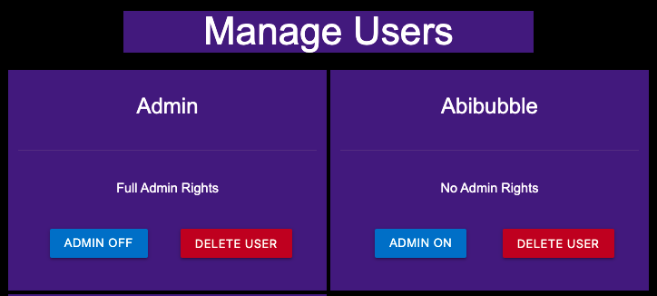

# The Bar Blade


[Here is a link to the final project](https://ms3-the-bar-blade.herokuapp.com/homepage)

This is a cocktail recipe site, built for bartenders, by bartenders. It's a site where users can sign in, find cocktails, add their own cocktails, and edit or delete old cocktail recipes. It is designed to be responsive on a wide range of devices, whilst also being easy to navigate through. 


## Contents

* [User Experience (UX)](#user-experience-(ux))
    * [Initial Discussion](#initial-discussion)
    * [User Stories](#user-stories)
    * [Project goals](#project-goals)

* [Design](#design)
    * [Color Scheme](#color-scheme)
    * [Typography](#typography)
    * [Imagery](#imagery)
    * [Wireframes](#wireframes)
    * [Features](#features)
    * [Future Features](#future-features)
    * [Audio](#audio)
    * [Navigation bar](#navigation-bar)

* [Database Design](#database-design)

* [Technologies Used](#technologies-used)
    * [Languages](#languages)
    * [Workspace](#workspace)
    * [Version Control](#version-control)
    * [Wireframing](#wireframing)
    * [Responsive Design](#responsive-design)
    * [Documentation](#documentation)
    * [Site Design](#site-design)
    * [Database Design](#database-design)
    * [Frameworks, Libraries and Others](#frameworks-libraries-and-others)

* [Deployment](#deployment)
    * [Initial Deployment](#initial-deployment)
    * [How to Fork it](#how-to-fork-it)
    * [Making a Local Clone](#making-a-local-clone)

* [Testing](#testing)
    * [W3C Validator](#w3c-validator)
    * [Testing User Stories](#testing-user-stories)
    * [Full Testing](#full-testing)
    * [Solved Bugs](#solved-bugs)
    * [Known Bugs](#known-bugs)
    * [Lighthouse](#lighthouse)
        * [Performance](#performance)
        * [Accessibility](#accessibility)
        * [Best Practices](#best-practices)
        * [SEO](#seo)

* [Credits](#credits)
    * [Code](#code)
    * [Content](#content)
    * [Media](#media)
    * [Acknowledgements](#acknowledgements)

---
## User Experience (UX)
### Initial Discussion
I wanted to create a website linked to a database, which allows users to login, add their own cocktails, or just search and find previously added cocktails. As an ex-bartender myself, this was something I always wanted but couldn't find online.

### User Stories
#### First Time Visitor Goals
As a first time visitor to this site, a user should be able to :
* Be able to easily navigate the site.
* Intuitively and easily understand what to do.
* Be able to register for an account.
* Search for a specific cocktail.
* Browse through all cocktails.
* Get visual feedback when an action on the site is completed.

#### Returning Visitor Goals
In addition to the First Time Visitor Goals, a Returning Visitor should be able to :
* Log in.
* Add new cocktails.
* Edit and delete the user's cocktails.
* See the cocktails the user has added.
* The user's password should be stored securely.
* Navigation should be intuitive, with no need to use the browser's back button.

#### Admin Goals
In addition to the First Time Visitor Goals and Returning Visitor Goals, as an administrator of this site, an admin user should be able to:
* A user shouldn't be able to brute force their way into the restricted pages.
* Edit or delete any cocktail recipe.
* Add a new category.
* Edit or delete any category.
* Give or remove admin rights.

### Project Goals
* This project has the goal of demonstrating my understanding of maintaining a database attached to a website, with full CRUD (Create, Read, Update and Delete) functionality.

---
## Design
### Color Scheme
* I decided on a very simple theme of purple and black for my color scheme.
* I didn't want to distract from the content of the site, hence choosing two main colours.
* I have used 3 different shades of purple to provide some contrast on the site.
* All text is white, which allows the text to be easily visible on all backgrounds.
* I have used other colors on buttons only:
    * I have used red only for the delete buttons, to convey the button is a destructive thing.
    * I have used green only for the cancel button on the delete modals, to signify a return to safety for the user.
    * I have used blue only for the edit buttons, to show that it's a creative thing.


### Typography
* I have used a barcode-style font from [Google Fonts](https://fonts.google.com/), called [Libre Barcode 128 Text](https://fonts.google.com/specimen/Libre+Barcode+128+Text), to form the logo. This has the fallback font of sans-serif.


* I have used a cursive font from [Google Fonts](https://fonts.google.com/), called [Dancing Script](https://fonts.google.com/specimen/Dancing+Script), to link with the theme of an elegant cocktail bar. This has the fallback font of cursive.


* The basic font-family of Arial, Helvetica, sans-serif has been used for the rest of the text, so as to not distract the user from the content of the site. This also comes with the bonus that it's standard with HTML, so it should render on any browser and any device.


### Imagery
* The images used in this project are all pictures of cocktails, to match the recipes.
* Icons are used where suitable to allow users to easily understand at a glance what is intended.
* Unfortunately there isn't much control about what images users upload. If any inappropriate images are added, the any admin user has the ability to edit the image.

### Wireframes
* [Wireframes for desktop, mobile and tablet for this project](static/docs/wireframes.pdf).
* [Database schema for this project](static/docs/database.pdf).

### Features
* Create, Edit and Delete a cocktail recipe.


* Create and Delete a profile.


* Create, Edit and Delete a category for admin users only.


* Edit admin rights and Delete a user for admin users only.



* Search for a specific cocktail.


* Confirm to delete modal.


* Auto-updating copyright year.


* A link to [Drink Aware](https://www.drinkaware.co.uk/) in the footer, for anyone struggling with alcohol use.


### Future Features
* Email verification before a user can add a cocktail.
* Enter user's password to delete user account.
* Create an 'Add to Favourites' so users can store their favourite cocktail recipes.

### Audio
* No audio is used in this project.

### Navigation bar
The navigation bar changes depending on user status and screen size:

| Nav Link | Logged Out | Logged In (User) | Logged In (Admin) |
|-------|-----|-----|-----|
| Logo (Homepage) | &#9989; | &#9989; | &#9989; |
| Home | &#9989; | &#9989; | &#9989; |
| Profile | &#10060; | &#9989; | &#9989; |
| Add Cocktail | &#10060; | &#9989; | &#9989; |
| Manage Categories | &#10060; | &#10060; | &#9989; |
| Manage Users | &#10060; | &#10060; | &#9989; |
| Log Out | &#10060; | &#9989; | &#9989; |
| Log In | &#9989; | &#10060; | &#10060; |
| Register | &#9989; | &#10060; | &#10060; |

* Logged in


* Logged out


* An admin


* On small screen sizes


---

## Database Design
MongoDB was used to store data for this site in a database. The data has been set out in three collections, which are described below:

| Users |    |
|-------|-----|
| _id | ObjectId |
| username | string |
| password | string |
| is_admin | boolean |

| Recipes |    |    |
|---|---|---|
| _id | ObjectId |    |
| category_id | ObjectId | categories._id |
| recipe_name | string |    |
| recipe_list | array |    |
| method | string |    |
| recipe_img | string |    |
| recipe_alt | string |    |
| user_id | ObjectId | users._id |

| Categories |    |
|---|---|
| _id | ObjectId |
| category_name | string |

The Recipes collection references both the Categories collection and the Users collection, using the ObjectId from the relevant fields to ensure that they automatically update if changes are made.

---

## Technologies Used
### Languages Used
* [HTML5](https://developer.mozilla.org/en-US/docs/Web/Guide/HTML/HTML5)
* [CSS3](https://developer.mozilla.org/en-US/docs/Archive/CSS3#:~:text=CSS3%20is%20the%20latest%20evolution,flexible%20box%20or%20grid%20layouts.)
* [JavaScript](https://developer.mozilla.org/en-US/docs/Web/JavaScript)
* [Python](https://www.python.org/)


### Workspace
#### GitPod:
[GitPod](https://gitpod.io/) was used as a virtual IDE workspace to build this site.


### Version Control
#### Git:
[Git](https://git-scm.com/) was used for version control by utilizing the Gitpod terminal to add and commit to Git and push to GitHub.
#### GitHub:
[GitHub](https://github.com/) is used to store the code for this project after being pushed from Git.


### Wireframing
#### Balsamiq:
[Balsamiq](https://balsamiq.com/) was used to create the wireframes during the design process.


### Responsive Design
#### Am I Responsive Design:
[Am I Responsive Design](http://ami.responsivedesign.is/#) was used to check the responsive design of the site, and to create the final site image.
#### Responsinator:
[Responsinator](http://www.responsinator.com/) was used to help improve the responsive design on a variety of devices.


### Documentation
#### Shields.io:
[Shields.io](https://shields.io/) was used to create the GitHub badges for the top of this README.md file.


### Site Design
#### Font Awesome:
[Font Awesome](https://fontawesome.com/) was used on all pages to add the icons.
#### Google Fonts:
[Google Fonts](https://fonts.google.com/) was used to select all the fonts on the site.
#### Favicon.io:
[favicon.io](https://favicon.io/) used to create a site favicon.
#### Imgur:
[Imgur](https://imgur.com/) was used to host images to add to each cocktail recipe.


### Database Design
#### MongoDB:
[MongoDB](https://www.mongodb.com/) was used to store the contents of the database, and allow full CRUD functionality.
#### Flask-PyMongo:
[Flask-PyMongo](https://flask-pymongo.readthedocs.io/en/latest/) was used to connect my Python / Flask app to MongoDB.


### Frameworks, Libraries and Others
#### Heroku:
[Heroku](https://www.heroku.com) was used to deploy the live site.
#### Google DevTools:
[Google DevTools](https://developer.chrome.com/docs/devtools/) was used to help find what code correlated to which feature.
#### Lighthouse:
[Lighthouse](https://developers.google.com/web/tools/lighthouse) was used to ensure that the code was as performant as possible, confirming to best practices, and SEO and Accessibility guidelines.
#### Flask:
[Flask](https://flask.palletsprojects.com/en/2.0.x/) was used to help create the templating for this site.
#### Materialize:
[Materialize](https://materializecss.com/) was used to create a beautiful, responsive website.
#### jQuery:
[jQuery](https://jquery.com/) was used to make the DOM traversal easier within the JavaScript.
#### Jinja:
[Jinja](https://jinja.palletsprojects.com/en/3.0.x/) was used to auto-populate the site with the contents of the database.
#### RandomKeygen:
[RandomKeygen](https://randomkeygen.com/) was used to generate a strong `SECRET_KEY`.
#### Flask-paginate:
[Flask-paginate](https://pythonhosted.org/Flask-paginate/) was used to add pagination to the homepage.
#### pip:
[pip](https://pip.pypa.io/en/stable/) was used to install the required dependancies for this site.
#### dnspython:
[dnspython](https://pypi.org/project/dnspython/) was used to provide access to DNS.

## Deployment
### Requirements for Deployment
* Python
* MongoDB account and database
* GitHub account
* Heroku account

### Initial Deployment
This site was deployed to Heroku by following these steps:

1. Heroku needs to be told what the requirements are for this project, so go into your GitPod terminal, and create files to explain the requirements by using the following commands:
    * `pip3 freeze --local > requirements.txt`
    * `echo web: python run.py > Procfile` - Ensure there is no blank line after the contents of this file
2. Push these changes to your repository.
3. Ensure you have a .gitignore file in your repository, and if not, create one.
4. Add `env.py` and `__pycache__/` into your .gitignore file, and save the file. This is to avoid any sensitive information being added into your repository.
5. Create an env.py file, and add the following information to it, updating the '## x ##' values with your own values:

``` python
import os

os.environ.setdefault("IP", "0.0.0.0")
os.environ.setdefault("PORT", "5000")
os.environ.setdefault("SECRET_KEY", " ## YOUR UNIQUE SECRET KEY ## ")
os.environ.setdefault("MONGO_URI", " ## YOUR UNIQUE URI FROM MONGODB ## ")
os.environ.setdefault("MONGO_DB", " ## YOUR DATABASE NAME ## ")
```

MONGO_DBNAME - This is the name of the database you need to connect to in MongoDB.
MONGO_URI - This can be found on the MongoDB website by following these steps:
    * In the clusters tab of your database, click connect on the associated cluster.
    * Click 'Connect', then 'Connect your application'.
    * Copy the string, then substitute the password (from Database access NOT your MongoDB password) and change "myFirstDatabase" to your MONGO_DBNAME.
SECRET_KEY - This is a custom string set up to keep sessions secure. I recommend using a 'Fork Knox' level password generated by [RandomKeygen](https://randomkeygen.com/).

6. Login or sign up to [Heroku](https://www.heroku.com).
7. Select 'Create New App' in the top right of your dashboard.
8. Choose a unique app name, and select the region closest to you, before clicking 'Create App'.
9. Go to the 'Deploy' tab, find 'Deployment Method' and select 'GitHub'.
10. Search to find your GitHub repository, and click 'Connect'. Don't enable automatic deployment yet, as this can cause errors.
11. Go to the 'Settings' tab, find 'Config Vars', and click 'Reveal Config Vars'.
12. Enter key value pairs that match those in your env.py file, displayed like this :

| Key | Value |
|---|---|
| IP | 0.0.0.0 |
| PORT | 5000 |
| MONGO_DBNAME | ## YOUR DATABASE NAME ## |
| MONGO_URI | ## YOUR MONGO_URI ## |
| SECRET_KEY | ## YOUR SECRET_KEY ## |

13. Go to the 'Deploy' tab, and click 'Enable Automatic Deployment'.
14. In 'Manual Deploy', choose which branch you'd like to deploy from (I chose 'master' branch, this is also known as 'main').
15. Click 'Deploy Branch' to deploy your app onto the Heroku servers.
16. Once the app has finished building, click 'Open App' to open your site.

### How to Fork it
1. Login or Sign Up to [GitHub](www.github.com).
2. On GitHub, go to [Abibubble/ms3-the-bar-blade](https://github.com/Abibubble/ms3-the-bar-blade).
3. In the top right, click "Fork".
4. You will need to create an env.py file with your own values, and create a MongoDB database with the data keys and types as shown above.
5. You will also need to install all of the project requirements. This can be done using the command `pip3 install -r requirements.txt`.
6. Type `python3 app.py` in your GitPod terminal to run your local site of this project.

### Making a Local Clone
1. Log in to [GitHub](https://www.github.com) and locate the [Repository](https://github.com/Abibubble/ms3-the-bar-blade) for this site.
2. Under the repository name, above the list of files, click "Code".
3. Here you can either Clone or Download the repository.
4. You should clone the repository using HTTPS, clicking on the icon to copy the link.
5. Open Git Bash.
6. Change the current working directory to the new location, where you want the cloned directory to be.
6. Type `git clone`, and then paste the URL that was copied in Step 4.
7. Press Enter, and your local clone will be created.
8. You will need to create an env.py file with your own values, and create a MongoDB database with the data keys and types as shown above.
9. You will also need to install all of the project requirements. This can be done using the command `pip3 install -r requirements.txt`.
10. Type `python3 app.py` in your GitPod terminal to run your local site of this project.

For a more detailed version of these steps, go to the [Github Docs](https://docs.github.com/en/github/creating-cloning-and-archiving-repositories/cloning-a-repository#cloning-a-repository-to-github-desktop) page on this topic.

---
## Testing
### W3C Validator
The W3C Markup Validator, W3C CSS Validator, JSHint were used to validate the project to ensure there were no syntax errors within the site.

1. W3C HTML Markup Validator
    * [Homepage](https://validator.w3.org/nu/?doc=https%3A%2F%2Fms3-the-bar-blade.herokuapp.com%2Fhomepage)
    * [Register](https://validator.w3.org/nu/?doc=https%3A%2F%2Fms3-the-bar-blade.herokuapp.com%2Fregister)
    * [Log In](https://validator.w3.org/nu/?doc=https%3A%2F%2Fms3-the-bar-blade.herokuapp.com%2Flogin)
    * Unfortunately, as it's not possible to log in using the Validator, it was only possible to test the 3 pages available to a user who isn't logged in.

2. W3C CSS Validator
    * [Homepage](https://jigsaw.w3.org/css-validator/validator?uri=https%3A%2F%2Fms3-the-bar-blade.herokuapp.com%2Fhomepage&profile=css3svg&usermedium=all&warning=1&vextwarning=&lang=en)
    * [Register](https://jigsaw.w3.org/css-validator/validator?uri=https%3A%2F%2Fms3-the-bar-blade.herokuapp.com%2Fregister&profile=css3svg&usermedium=all&warning=1&vextwarning=&lang=en)
    * [Log In](https://jigsaw.w3.org/css-validator/validator?uri=https%3A%2F%2Fms3-the-bar-blade.herokuapp.com%2Flogin&profile=css3svg&usermedium=all&warning=1&vextwarning=&lang=en)
    * Unfortunately, as it's not possible to log in using the Validator, it was only possible to test the 3 pages available to a user who isn't logged in.
    * There is only one error appearing, which is from the Materialize CSS file.
    * There are several warnings, mostly from the Materialize CSS file, but also three related to my purple variables. As these variables are acceptable CSS syntax, I've considered them to be not an error.

3. JSHint
    * [JSHint](https://jshint.com/)
    * There is one undefined variable, which is due to the jQuery `$`.
    * There are three unused variables, which are used in onclick functions in my HTML.


4. PEP8 Online
    * [PEP8 Online](http://pep8online.com/)


### Testing User Stories
#### First Time Visitor Goals
##### Be able to easily navigate the site.
* The navigation bar is clearly visible on all pages.
* The navigation bar is fixed to the top of the screen, so even when the user scrolls, they can still see the navigation bar.

##### Intuitively and easily understand what to do.
* Everything is clearly laid out.
* All buttons decribe what they're for in simple terms.
* Icons are used to help convey meaning.

##### Be able to register for an account.
* The register button is clear to see on the navigation bar.
* It only requires a username, a password, and a confirmation of that password to register an account.

##### Search for a specific cocktail.
* The search bar is displayed prominently on the homepage for all users, whether logged in or not.

##### Browse through all cocktails.
* All cocktails are displayed on the homepage for all users to view.

##### Get visual feedback when an action on the site is completed.
* A flash message appears at the top of the screen when :
    * Any item is added.
    * Any item is edited.
    * Any item is deleted.
    * A user registers.
    * A user logs in.
    * A user logs out.

#### Returning Visitor Goals
##### Log in.
* The log in button is visible in the navigation bar.
* The log in process is intuitive and simple to use.

##### Add new cocktails.
* The 'Add Cocktail' button is available on the navigation bar once you log in.
* Every input field on the Add Cocktail form is clearly defined.
* There is a helpful reminder about accessibility when adding an image to the site.
* If the user hasn't added any cocktails, their profile prompts them to add one, with a helpful button to direct them to the 'Add Cocktail' page.

##### Edit and delete the user's cocktails.
* Every cocktail that a user has added is displayed on their profile.
* Each cocktail listing has it's own edit and delete buttons.
* There is a link to add a cocktail on the navigation bar, which is available on every page.
* If the user hasn't added any cocktails, their profile instead prompts them to add one, with a helpful button to direct them to the 'Add Cocktail' page.

##### See the cocktails the user has added.
* Every cocktail that a user has added is displayed on their profile.

##### The user's password should be stored securely.
* Werkzeug's password hashing methods have been used to store all user's passwords in a secure and safe way.

##### Navigation should be intuitive, with no need to use the browser's back button.
* The navigation bar is constantly visible across the top of the site.
* This is either the full navigation bar, or the condensed burger icon menu bar on smaller screen sizes.

#### Admin Goals
##### A user shouldn't be able to brute force their way into the restricted pages.
* Admin users are set with an is_admin toggle in the database, so that it doesn't rely on usernames.
* If a user without access rights tries to access a restricted page, it presents them with the 404 page, with a navigation bar at the top to take them back to the pages they're allowed to access.

##### Edit or delete any cocktail recipe.
* Admin users are set with an is_admin toggle in the database, so that it doesn't rely on usernames.
* If the user has the is_admin toggle set to true, then all recipes are displayed on their profile.
* This includes all recipes created by other users, with edit and delete buttons.
* This enabled the admin to edit or delete any recipe.

##### Add a new category.
* Admin accounts have access to the 'Manage Categories' page.
* This allows them to add a new category.

##### Edit or delete any category.
* Admin accounts have access to the 'Manage Categories' page.
* This allows them to edit or delete any categories.

##### Give or remove admin rights.
* Admin users are set with an is_admin toggle in the database, so that it doesn't rely on usernames.
* If the user has the is_admin toggle set to true, then they have access to the Manage Users page.
* From there, any user can be deleted, or have their admin rights switched on or off.
* The only user that cannot be edited is the main admin account, to ensure the site isn't left without an admin user by mistake.

### Full Testing
[Click here to view the full testing steps](static/docs/TESTING.md) that were completed on every device and browser, and screenshots of testing.

### Solved Bugs
1. When I added the confirm deletion modal into categories.html, it wasn't taking the category I'd clicked on to delete, it was just deleting the first category in the list.
    * I looked through my code on Google DevTools and saw that, as my delete button was part of a for loop that was populating categories, it was also duplicating the ID of the modal.
    * This meant that when it came to deleting, it didn't know which one of those IDs I actually wanted to delete.
    * I then added in the `category._id` to each modal ID, so I could have an individual ID for each category.
    * This solved the bug, and also fixed an issue that W3C HTML validator brought up about repeated IDs.
2. When the user clicked the 'delete' or 'edit' buttons on their profile cocktails, the collapsible would expand as well as the button's action.
    * I discovered that, as the buttons were inside the collapsible-header Materialize class, they were being treated as clickable too.
    * I attempted to move them to the right of the headers, but this resulted in the buttons not connecting to their cocktail recipes.
    * Instead, I moved them into the expanded section, so now the user can click on the header to expand, and depending on the contents of the recipe, can then decide to delete or edit.
    * This makes more sense than where I had them before, as the user won't know if they want to edit or delete a recipe until they've looked at it.
3. The favicon files were throwing up errors in the console, as shown below.
    * I checked that the files I was including were correct, accoring to [Favicon.io](https://favicon.io/), which was where I got my favicon from.
    * I then did a Google search and found [this article on Medium](https://medium.com/@aurelien.delogu/401-error-on-a-webmanifest-file-cb9e3678b9f3) which suggested a possible fix.
    * I added `crossorigin="use-credentials"` to my link for the webmanifest file, which fixed the console errors.
    * 
4. The user couldn't view the Homepage without being logged in - which also meant that they couldn't log in.
    * In my navigation bar, I was using `` to check if the current user has the is_admin toggle set to true.
    * However, if the user isn't logged in, there was no information about the user, causing `KeyError: 'user'` to show.
    * In my base.html, I changed the `` to `` to check if the user was logged in first.
    * I then added a try/except block in my app.py file to try to find the logged in user, but if that wasn't found, to select all users instead.
    * This fixed this bug.
5. When adding a cocktail, the ingredients add as expected, but if there's more than one additional ingredient, the ingredients won't remove properly.
    * I used `console.log()` to ensure I was referencing the correct elements.
    * I discovered that the counter variable wasn't being referenced correctly from the `elRemove` variable.
    * I created a new variable to find the counter for the clicked remove button, and used that to reference.
    * I then used Google DevTools to inspect my code and discovered that the remove button was being given a number from the counter that was one too high for the element it was meant to be referencing.
    * I changed it to `let thisRemoveButton = removeButton.replaceAll("*", counter-1);` which fixed this bug.

### Known Bugs
* None found, if any errors are found, please contact me via my GitHub ([Abibubble](https://github.com/Abibubble/)) to get them fixed.

### Lighthouse
I tested my website using DevTools Lighthouse feature, and got these results:

#### Desktop


#### Mobile


#### Performance:
* The main issue was the fact that images do not have explicit width and height. This was necessary, as there is no way of knowing what size images users will be submitting with their cocktails, and it would cause more issues with images being stretched or squashed.

#### Accessibility:
* All images have alt text, including a request for users to add alt text for their own images so the site stays fully accessible.
* All icons have titles where text isn't otherwise present to explain their use.
* All tap targets are correctly sized, and aren't overlapping other content.
* All colors are WCAG AA compliant. The majority are AAA compliant, except for the Delete and Edit buttons.


#### Best Practices:
* This was knocked down due to an issue in the console.
* The console error is due to the new SameSite cookie issue Google has introduced, which I wasn't able to find a fix for.

#### SEO:
* The only thing causing issues with SEO was that not all links are crawlable.
* The links it's referring to are the pagination links, which I don't have control over due to my use of Flask-paginate to create the pagination for this site.

---
## Credits
### Code
* [Font Awesome](https://fontawesome.com/): Library of icons used for social media and download links.
* [Materialize](https://materializecss.com/): Throughout the site, to create a beautiful responsive site, without taking too much time.
* [Code Institute](https://codeinstitute.net/): For the select form element validation.
* [This article on Medium](https://medium.com/@aurelien.delogu/401-error-on-a-webmanifest-file-cb9e3678b9f3) for helping me fix bug #3.
* [This GitHub repo from mozillazg](https://gist.github.com/mozillazg/69fb40067ae6d80386e10e105e6803c9) for help with the pagination.

### Content
* All content was created by [Abi Harrison](https://github.com/Abibubble).

### Media
* Screwdriver - Photo by [Gerhard G.](https://pixabay.com/users/blende12-201217/?utm_source=link-attribution&amp;utm_medium=referral&amp;utm_campaign=image&amp;utm_content=2029118) from Pixabay.
* Long Island Iced Tea - Photo by [Robert Krajewski](https://pixabay.com/users/robert84ak-16722616/?utm_source=link-attribution&amp;utm_medium=referral&amp;utm_campaign=image&amp;utm_content=5374802) from Pixabay.
* Negroni - Photo by [Isabella Mendes](https://www.pexels.com/@isabella-mendes-107313) from Pexels.
* Godfather - Photo by [Marta Dzedyshko](https://www.pexels.com/@marta-dzedyshko-1042863) from Pexels.
* Mojito - Photo by [StockSnap](https://pixabay.com/users/stocksnap-894430/?utm_source=link-attribution&amp;utm_medium=referral&amp;utm_campaign=image&amp;utm_content=698499) from Pixabay.
* Sex on the beach - Photo by [Geraud pfeiffer](https://www.pexels.com/@geraud-pfeiffer?utm_content=attributionCopyText&utm_medium=referral&utm_source=pexels) from Pexels.
* Bellini - Photo by [Sabel Blanco](https://www.pexels.com/@sabel-blanco-662810?utm_content=attributionCopyText&utm_medium=referral&utm_source=pexels) from Pexels.
* Aperol - Photo by [Kristina Paukshtite](https://www.pexels.com/@kpaukshtite?utm_content=attributionCopyText&utm_medium=referral&utm_source=pexels) from Pexels.
* Shirley Temple - Photo by [Tim Douglas](https://www.pexels.com/@tim-douglas?utm_content=attributionCopyText&utm_medium=referral&utm_source=pexels) from Pexels.
* Fuzzy Navel - Image by [Sergej Cankov](https://pixabay.com/users/webarts-578779/?utm_source=link-attribution&amp;utm_medium=referral&amp;utm_campaign=image&amp;utm_content=4199127) from Pixabay
* Whiskey Sour - Photo by [Geraud pfeiffer](https://www.pexels.com/@geraud-pfeiffer?utm_content=attributionCopyText&utm_medium=referral&utm_source=pexels) from Pexels.
* London Lemonade - Photo by [Geraud pfeiffer](https://www.pexels.com/@geraud-pfeiffer?utm_content=attributionCopyText&utm_medium=referral&utm_source=pexels) from Pexels.
* Blue Lagoon - Photo by [Nerfee Mirandilla](https://www.pexels.com/@nerfee-mirandilla-1656989?utm_content=attributionCopyText&utm_medium=referral&utm_source=pexels) from Pexels.
* Favicon - Image by [Clker-Free-Vector-Images](https://pixabay.com/users/clker-free-vector-images-3736/?utm_source=link-attribution&amp;utm_medium=referral&amp;utm_campaign=image&amp;utm_content=35622) from Pixabay.

### Acknowledgements
* My mentor, Antonio Rodriguez, at [Code Institute](https://codeinstitute.net/), for continuous helpful feedback and support.
* [Eve Crabb](https://github.com/evecrabb), for her support through my learning, for being a sounding board for bug fixes, and for being the best boss ever.
* The team at [Code Institute](https://codeinstitute.net/), for teaching me the necessary skills to create this site.
* Conor Nye for his continuous support throughout my coding journey.
