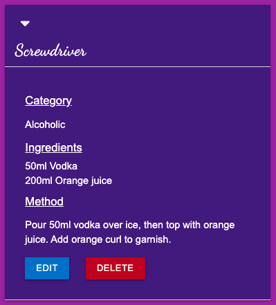
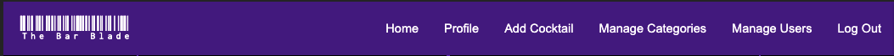

# The Bar Blade


[Here is a link to the final project](https://ms3-the-bar-blade.herokuapp.com/homepage)

This is a cocktail recipe site, built for bartenders, by bartenders. It's a site where users can sign in, find cocktails, add their own cocktails, and edit or delete old cocktail recipes. It is designed to be responsive on a wide range of devices, whilst also being easy to navigate through. 


## Contents

* [User Experience (UX)](#user-experience-(ux))
    * [Initial Discussion](#initial-discussion)
    * [User Stories](#user-stories)
    * [Project goals](#project-goals)

* [Design](#design)
    * [Color Scheme](#color-scheme)
    * [Typography](#typography)
    * [Imagery](#imagery)
    * [Wireframes](#wireframes)
    * [Features](#features)
    * [Audio](#audio)

* [Database Design](#database-design)

* [Technologies Used](#technologies-used)
    * [Languages Used](#languages-used)
    * [Frameworks, Libraries & Programs Used](#frameworks-libraries-and-programs-used)

* [Deployment](#deployment)
    * [Initial Deployment](#initial-deployment)
    * [How to Fork it](#how-to-fork-it)
    * [Making a Local Clone](#making-a-local-clone)

* [Testing](#testing)
    * [W3C Validator](#w3c-validator)
    * [Testing User Stories](#testing-user-stories)
    * [Full Testing](#full-testing)
    * [Solved Bugs](#solved-bugs)
    * [Known Bugs](#known-bugs)
    * [Lighthouse](#lighthouse)
        * [Performance](#performance)
        * [Accessibility](#accessibility)
        * [Best Practices](#best-practices)
        * [SEO](#seo)

* [Credits](#credits)
    * [Code](#code)
    * [Content](#content)
    * [Media](#media)
    * [Acknowledgements](#acknowledgements)

---
## User Experience (UX)
### Initial Discussion
I wanted to create a website linked to a database, which allows users to login, add their own cocktails, or just search and find previously added cocktails. As an ex-bartender myself, this was something I always wanted but couldn't find online.

### User Stories
#### First Time Visitor Goals
* To be able to easily navigate the site.
* It should be easy to understand what to do.
* It should be easy to register for an account.
* It should be easy to search for a specific cocktail.

#### Returning Visitor Goals
* It should be easy to add, edit and delete the user's cocktails.
* It should be easy to see the cocktails the user has added.
* The user's password should be stored securely.
* It should be easy to search for a specific cocktail.

#### Frequent Visitor Goals
* It should be easy to search for a specific cocktail.
* Navigation should be intuitive, with no need to use the browser's back button.

#### Admin Goals
* Other users shouldn't be able to edit or delete the user's cocktails.
* A user shouldn't be able to brute force their way into the restricted pages.
* Be able to edit or delete any recipe as an admin.

### Project Goals
* This project has the goal of demonstrating my understanding of maintaining a database attached to a website, with full CRUD (Create, Read, Update and Delete) functionality.

---
## Design
### Color Scheme
* I decided on a very simple theme of purple and black for my color scheme.
* I didn't want to distract from the content of the site, hence choosing two main colours.
* I have used 3 different shades of purple to provide some contrast on the site.
* All text is white, which allows the text to be easily visible on all backgrounds.
* I have used other colors on buttons only:
    * I have used red only for the delete buttons, to convey the button is a destructive thing.
    * I have used green only for the cancel button on the delete modals, to signify a return to safety for the user.
    * I have used blue only for the edit buttons, to show that it's a creative thing.


### Typography
* I have used a barcode-style font from [Google Fonts](https://fonts.google.com/), called [Libre Barcode 128 Text](https://fonts.google.com/specimen/Libre+Barcode+128+Text), to form the logo. This has the fallback font of sans-serif.


* I have used a cursive font from [Google Fonts](https://fonts.google.com/), called [Dancing Script](https://fonts.google.com/specimen/Dancing+Script), to link with the theme of an elegant cocktail bar. This has the fallback font of cursive.


* The basic font-family of Arial, Helvetica, sans-serif has been used for the rest of the text, so as to not distract the user from the content of the site. This also comes with the bonus that it's standard with HTML, so it should render on any browser and any device.


### Imagery
* The images used in this project are all pictures of cocktails, to match the recipes.
* Icons are used where suitable to allow users to easily understand at a glance what is intended.
* Unfortunately there isn't much control about what images users upload. If any inappropriate images are added, the any admin user has the ability to edit the image.

### Wireframes
[Here are the wireframes for desktop, mobile and tablet for this project](static/docs/wireframes.pdf).

### Features
* Create, Edit and Delete a cocktail recipe.


* Create and Delete a profile.


* Create, Edit and Delete a category for admin users only.


* Search for a specific cocktail.


* Confirm to delete modal.


* Auto-updating copyright year.


* A link to [Drink Aware](https://www.drinkaware.co.uk/) in the footer, for anyone struggling with alcohol use.


* Navigation bar which changes depending on user status and screen size:
    * Logged in
    

    * Logged out
    

    * An admin
    

    * On small screen sizes
    
    

### Audio
* No audio is used in this project.
---

## Database Design
MongoDB was used to store data for this site in a database. The data has been set out in three collections, which are described below:

| Users |    |
|-------|-----|
| _id | ObjectId |
| username | string |
| password | string |

| Recipes |    |
|---|---|
| _id | ObjectId |
| category | string |
| recipe_name | string |
| recipe_list | array |
| method | string |
| recipe_img | string |
| recipe_alt | string |
| created_by | string |

| Categories |    |
|---|---|
| _id | ObjectId |
| category_name | string |

---

## Technologies Used
### Languages Used
* [HTML5](https://developer.mozilla.org/en-US/docs/Web/Guide/HTML/HTML5)
* [CSS3](https://developer.mozilla.org/en-US/docs/Archive/CSS3#:~:text=CSS3%20is%20the%20latest%20evolution,flexible%20box%20or%20grid%20layouts.)
* [JavaScript](https://developer.mozilla.org/en-US/docs/Web/JavaScript)
* [Python](https://www.python.org/)

### Frameworks Libraries and Programs Used
#### Git:
[Git](https://git-scm.com/) was used for version control by utilizing the Gitpod terminal to add and commit to Git and push to GitHub.
#### GitHub:
[GitHub](https://github.com/) is used to store the code for this project after being pushed from Git.
#### Heroku:
[Heroku](https://www.heroku.com) was used to deploy the live site.
#### Balsamiq:
[Balsamiq](https://balsamiq.com/) was used to create the wireframes during the design process.
#### Responsinator:
[Responsinator](http://www.responsinator.com/) was used to help improve the responsive design on a variety of devices.
#### Google DevTools:
[Google DevTools](https://developer.chrome.com/docs/devtools/) was used to help find what code correlated to which feature.
#### Am I Responsive Design:
[Am I Responsive Design](http://ami.responsivedesign.is/#) was used to check the responsive design of the site, and to create the final site image.
#### Shields.io:
[Shields.io](https://shields.io/) was used to create the GitHub badges for the top of this README.md file.
#### Lighthouse:
[Lighthouse](https://developers.google.com/web/tools/lighthouse) was used to ensure that the code was as performant as possible, confirming to best practices, and SEO and Accessibility guidelines.
#### Font Awesome:
[Font Awesome](https://fontawesome.com/) was used on all pages to add the icons.
#### Autoprefixer CSS online
[Autoprefixer CSS online](https://autoprefixer.github.io/) was used to ensure all prefixes for browsers were included correctly.
#### MongoDB:
[MongoDB](https://www.mongodb.com/) was used to store the contents of the database, and allow full CRUD functionality.
#### Flask:
[Flask](https://flask.palletsprojects.com/en/2.0.x/) was used to help create the templating for this site.
#### Materialize:
[Materialize](https://materializecss.com/) was used to create a beautiful, responsive website.
#### jQuery:
[jQuery](https://jquery.com/) was used to make the DOM traversal easier within the JavaScript.
#### Google Fonts:
[Google Fonts](https://fonts.google.com/) was used to select all the fonts on the site.
#### Jinja:
[Jinja](https://jinja.palletsprojects.com/en/3.0.x/) was used to auto-populate the site with the contents of the database.
#### RandomKeygen:
[RandomKeygen](https://randomkeygen.com/) was used to generate a strong secret key.

## Deployment
### Initial Deployment
This site was deployed to GitHub Pages by following these steps:
1. Login or Sign Up to [GitHub](https://www.github.com).
2. Create a new repository named "ms3-the-bar-blade".
3. Heroku needs to be told what the requirements are for this project, so go into your GitPod terminal, and create files to explain the requirements by using the following commands:
    * `pip3 freeze --local > requirements.txt`
    * `echo web: python run.py > Procfile` - Ensure there is no blank line after the contents of this file
4. Push these changes to your repository.
5. Ensure you have a .gitignore file in your repository, and if not, create one.
6. Add `env.py` and `__pycache__/` into your .gitignore file, and save the file. This is to avoid any sensitive information being added into your repository.
7. Create an env.py file, and add the following information to it, updating the '## x ##' values with your own values:

``` python
import os

os.environ.setdefault("IP", "0.0.0.0")
os.environ.setdefault("PORT", "5000")
os.environ.setdefault("SECRET_KEY", " ##YOUR UNIQUE SECRET KEY## ")
os.environ.setdefault("MONGO_URI", " ##YOUR UNIQUE URI FROM MONGODB## ")
os.environ.setdefault("MONGO_DB", " ##YOUR DATABASE NAME## ")
```

8. Login or sign up to [Heroku](https://www.heroku.com).
9. Select 'Create New App' from your dashboard.
10. Choose a unique app name, and select the region closest to you, before clicking 'Create App'.
11. Go to the 'Deploy' tab, find 'Deployment Method' and select 'GitHub'.
12. Search to find your GitHub repository, and click 'Connect'. Don't enable automatic deployment yet, as this can cause errors.
13. Go to the 'Settings' tab, find 'Config Vars', and click 'Reveal Config Vars'.
14. Enter key value pairs that match those in your env.py file as shown above.
15. Go to the 'Deploy' tab, and click 'Enable Automatic Deployment'.
16. In 'Manual Deploy', choose which branch you'd like to deploy from (I chose 'master' branch, this is also known as 'main').
17. Click 'Deploy Branch'.
18. Once the app has finished building, click 'Open App' to open your site.

### How to Fork it
1. Login or Sign Up to [GitHub](www.github.com).
2. On GitHub, go to [Abibubble/ms3-the-bar-blade](https://github.com/Abibubble/ms3-the-bar-blade).
3. In the top right, click "Fork".
4. You will need to create an env.py file with your own values, and create a MongoDB database.
5. You will also need to install all of the project requirements. This can be done using the command `pip3 install -r requirements.txt`.

### Making a Local Clone
1. Log in to [GitHub](https://www.github.com) and locate the [Repository](https://github.com/Abibubble/ms3-the-bar-blade) for this site.
2. Under the repository name, above the list of files, click "Code".
3. Here you can either Clone or Download the repository.
4. You should clone the repository using HTTPS, clicking on the icon to copy the link.
5. Open Git Bash.
6. Change the current working directory to the new location, where you want the cloned directory to be.
6. Type `git clone`, and then paste the URL that was copied in Step 4.
7. Press Enter, and your local clone will be created.
8. You will need to create an env.py file with your own values, and create a MongoDB database.
9. You will also need to install all of the project requirements. This can be done using the command `pip3 install -r requirements.txt`.

For a more detailed version of these steps, go to the [Github Docs](https://docs.github.com/en/github/creating-cloning-and-archiving-repositories/cloning-a-repository#cloning-a-repository-to-github-desktop) page on this topic.

---
## Testing
### W3C Validator
The W3C Markup Validator, W3C CSS Validator, JSHint were used to validate the project to ensure there were no syntax errors within the site.

1. W3C Markup Validator
    * [HTML Results](LINK)

2. W3C CSS Validator
    * [CSS Results](LINK)
    * There is only one error appearing, which is from the Materialize CSS file.
    * There are several warnings, mostly from the Materialize CSS file, but also three related to my purple variables. As these variables are acceptable CSS syntax, I've considered them to be not an error.

3. JSHint
    * [JSHint](https://jshint.com/)


### Testing User Stories
#### First Time Visitor Goals
##### To be able to easily navigate the site.
* The navigation bar is clearly visible on all pages.
* The navigation bar is fixed to the top of the screen, so even when the user scrolls, they can still see the navigation bar.

##### It should be easy to understand what to do.
* Everything is clearly laid out.
* All buttons decribe what they're for in simple terms.
* Icons are used to help convey meaning.

##### It should be easy to register for an account.
* The register button is clear to see on the navigation bar, and it only requires a username, a password, and a confirmation of that password to register an account.

##### It should be easy to search for a specific cocktail.
* The search bar is displayed prominently on the homepage for all users, whether logged in or not.

#### Returning Visitor Goals
##### It should be easy to add, edit and delete the user's cocktails.
* Every cocktail that a user has added is displayed on their profile.
* Each cocktail listing has it's own edit and delete buttons.
* There is a link to add a cocktail on the navigation bar, which is available on every page.
* If the user hasn't added any cocktails, their profile instead prompts them to add one, with a helpful button to aid them.

##### It should be easy to see the cocktails the user has added.
* Every cocktail that a user has added is displayed on their profile.

##### The user's password should be stored securely.
* Werkzeug's password hashing methods have been used to store all user's passwords in a secure and safe way.

##### It should be easy to search for a specific cocktail.
* The search bar is displayed prominently on the homepage for all users, whether logged in or not.

#### Frequent Visitor Goals
##### It should be easy to search for a specific cocktail.
* The search bar is displayed prominently on the homepage for all users, whether logged in or not.

##### Navigation should be intuitive, with no need to use the browser's back button.
* 

#### Admin Goals
##### Other users shouldn't be able to edit or delete the user's cocktails.
* Edit and delete buttons are only shown for cocktails on the user's profile.
* The only cocktails shown on the user's profile are the ones created by them.

##### A user shouldn't be able to brute force their way into the restricted pages.
* 

##### Be able to edit or delete any recipe as an admin.
* 

### Full Testing
[Click here](static/docs/TESTING.md) to view the full testing steps that were completed on every device and browser, and screenshots of testing.

### Solved Bugs
1. When I added the confirm deletion modal into categories.html, it wasn't taking the category I'd clicked on to delete, it was just deleting the first category in the list.
    * I looked through my code on Google DevTools and saw that, as my delete button was part of a for loop that was populating categories, it was also duplicating the ID of the modal.
    * This meant that when it came to deleting, it didn't know which one of those IDs I actually wanted to delete.
    * I then added in the `category._id`, so I could have an individual ID for each category.
    * This solved the bug, and also fixed the issue that W3C HTML validator brought up about repeated IDs.

### Known Bugs
* ANY BUGS LEFT IN THE CODE AFTER FINAL DEPLOYMENT, FOR FIXING IN FUTURE RELEASES

### Lighthouse
I tested my website using DevTools Lighthouse feature, and got these results:

#### Desktop


#### Mobile


#### Performance:
* EXPLAIN SCORE AND HOW I IMPROVED IT IF NECESSARY

#### Accessibility:
* EXPLAIN SCORE AND HOW I IMPROVED IT IF NECESSARY
* All images have alt text, including a request for users to add alt text for their own images so the site stays fully accessible.
* All icons have titles where text isn't otherwise present to explain their use.
* All colors are WCAG AA compliant. The majority are AAA compliant, except for the Delete buttons.


#### Best Practices:
* EXPLAIN SCORE AND HOW I IMPROVED IT IF NECESSARY

#### SEO:
* EXPLAIN SCORE AND HOW I IMPROVED IT IF NECESSARY

---
## Credits
### Code
* [Font Awesome](https://fontawesome.com/): Library of icons used for social media and download links.
* [Autoprefixer CSS online](https://autoprefixer.github.io/): To aid in the CSS prefixing.
* [Materialize](https://materializecss.com/): To create a beautiful responsive site, without taking too much time.
* [Code Institute](https://codeinstitute.net/): For the select form element validation.

### Content
* All content was created by [Abi Harrison](https://github.com/Abibubble).

### Media
* Screwdriver - Photo by [Gerhard G.](https://pixabay.com/users/blende12-201217/?utm_source=link-attribution&amp;utm_medium=referral&amp;utm_campaign=image&amp;utm_content=2029118) from Pixabay.
* Long Island Iced Tea - Photo by [Robert Krajewski](https://pixabay.com/users/robert84ak-16722616/?utm_source=link-attribution&amp;utm_medium=referral&amp;utm_campaign=image&amp;utm_content=5374802) from Pixabay.
* Negroni - Photo by [Isabella Mendes](https://www.pexels.com/@isabella-mendes-107313) from Pexels.
* Godfather - Photo by [Marta Dzedyshko](https://www.pexels.com/@marta-dzedyshko-1042863) from Pexels.
* Mojito - Photo by [StockSnap](https://pixabay.com/users/stocksnap-894430/?utm_source=link-attribution&amp;utm_medium=referral&amp;utm_campaign=image&amp;utm_content=698499) from Pixabay.
* Sex on the beach - Photo by [Geraud pfeiffer](https://www.pexels.com/@geraud-pfeiffer?utm_content=attributionCopyText&utm_medium=referral&utm_source=pexels) from Pexels
* Bellini - Photo by [Sabel Blanco](https://www.pexels.com/@sabel-blanco-662810?utm_content=attributionCopyText&utm_medium=referral&utm_source=pexels) from Pexels
* Aperol - Photo by [Kristina Paukshtite](https://www.pexels.com/@kpaukshtite?utm_content=attributionCopyText&utm_medium=referral&utm_source=pexels) from Pexels
* Shirley Temple - Photo by [Tim Douglas](https://www.pexels.com/@tim-douglas?utm_content=attributionCopyText&utm_medium=referral&utm_source=pexels) from Pexels
* Fuzzy Navel - Image by [Sergej Cankov](https://pixabay.com/users/webarts-578779/?utm_source=link-attribution&amp;utm_medium=referral&amp;utm_campaign=image&amp;utm_content=4199127) from Pixabay

### Acknowledgements
* My mentor, Antonio Rodriguez, at [Code Institute](https://codeinstitute.net/), for continuous helpful feedback and support.
* [Eve Crabb](https://github.com/evecrabb), for her support through my learning, for being a sounding board for bug fixes, and for being the best boss ever.
* The team at [Code Institute](https://codeinstitute.net/), for teaching me the necessary skills to create this site.
* Conor Nye for his continuous support throughout my coding journey.
