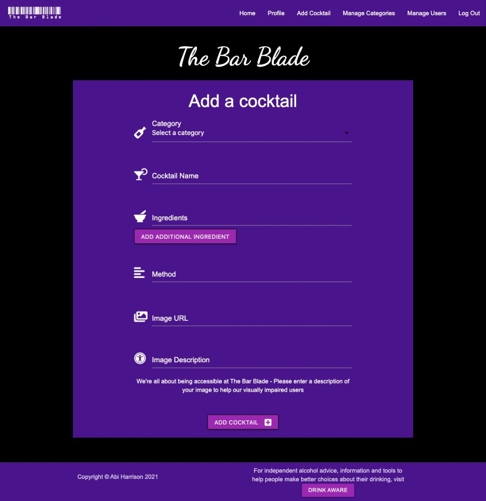
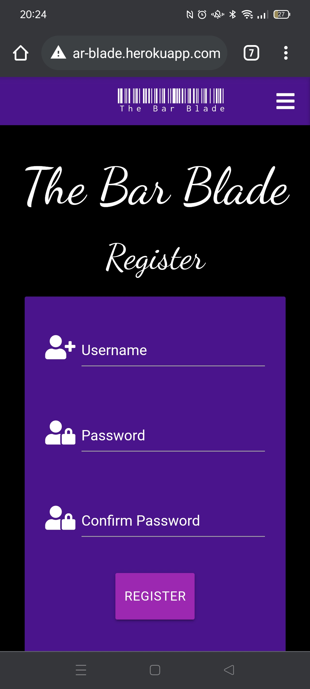
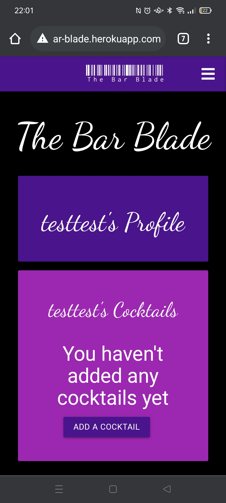
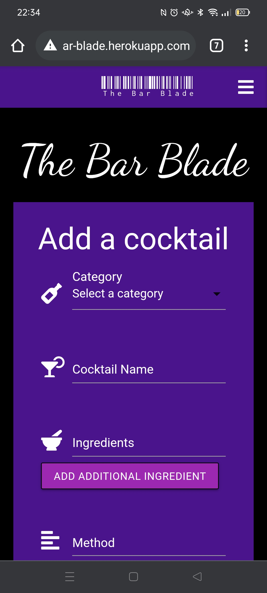
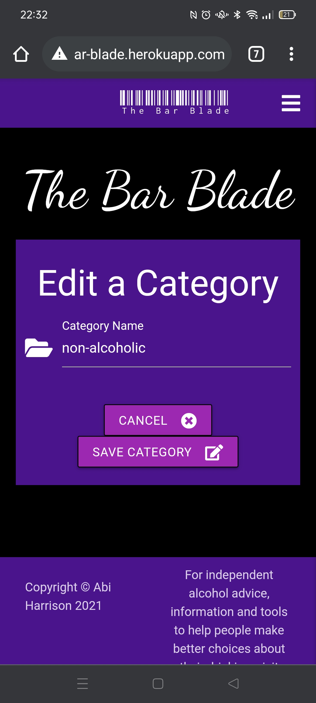

# Testing Steps

## Contents

* [Icon Key](#icon-key)
* [Devices and Browsers](#devices-and-browsers)
* [Links and Navigation](#links-and-navigation)
    * [Navigation Bar](#navigation-bar)
    * [Internal Navigation](#internal-navigation)
    * [Footer](#footer)
    * [Modals](#modals)
* [Styling and Layout](#styling-and-layout)
* [User Access](#user-access)
* [Functions](#functions)
    * [Register](#register)
    * [Log In](#log-in)
    * [Log Out](#log-out)
    * [Add Cocktail](#add-cocktail)
    * [Edit Cocktail](#edit-cocktail)
    * [Delete Cocktail](#delete-cocktail)
    * [Add Category](#add-category)
    * [Edit Category](#edit-category)
    * [Delete Category](#delete-category)
    * [Edit User](#edit-user)
    * [Delete User](#delete-user)
    * [Search Recipes](#search-recipes)
* [Database](#database)
* [Responsive Design](#responsive-design)
    * [Mobile](#mobile)
    * [Tablet](#tablet)
    * [Computer](#computer)
* [Images](#images)
    * [Desktop and Laptop](#desktop-and-laptop)
    * [Tablet](#tablet)
    * [Mobile](#mobile)

## Icon key

&#128100; <-- Logged In Only

&#128272; <-- Admin only access

&#128683; <-- Logged out only

## Devices and Browsers
### Desktop / Laptop
1. Google Chrome
    * All tested and working correctly.

2. Microsoft Edge
    * All tested and working correctly.

3. Mozilla Firefox
    * All tested and working correctly.

4. Safari
    * All tested and working correctly.

### Tablet
1. Safari
    * All tested and working correctly.

### Mobile
1. Google Chrome
    * All tested and working correctly.

2. Safari
    * All tested and working correctly.

3. Samsung Internet
    * All tested and working correctly.

### Full devices and browsers
* The website was tested on Google Chrome, Mozilla Firefox, Microsoft Edge, Safari and Samsung Internet browsers.
* Testing was not done on Internet Explorer due to it being depreciated in favour of Microsoft Edge.
* The website was viewed on a variety of devices, including:
    * Custom built desktop PC, running Windows 10
    * Acer Aspire V Nitro Laptop, running Windows 10
    * Lenovo B51 IntelCore i7 Laptop, running Ubuntu 16.04 LTS
    * MacBook Air7,2 (13-inch, 2017)
    * MacBook Pro (15-inch, 2017), running macOS Catalina
    * iPad 6,11 5th generation, running iOS 10.3
    * iPhone 7
    * iPhone X
    * iPhone 12
    * OPPO Find X2 Lite
    * OPPO Find X2
    * Samsung Galaxy A70
    * Samsung Galaxy S9
    * Samsung A20
    * xBox One

A large amount of testing was done to ensure that all pages were displayed, and all functionality worked as it should. Friends, family members, and other developers were asked to review the site and documentation to point out any bugs and/or user experience issues that they came across.

On every device and browser listed above, I tested the following:

## Links and Navigation
### Navigation Bar
* Click the Logo to take the user to the Home page from the Home page.
* &#128100; Click the Logo to take the user to the Home page from the Profile page.
* &#128100; Click the Logo to take the user to the Home page from the Add Cocktail page.
* &#128272; Click the Logo to take the user to the Home page from the Manage Categories page.
* &#128272; Click the Logo to take the user to the Home page from the Manage Users page.
* &#128683; Click the Logo to take the user to the Home page from the Log In page.
* &#128683; Click the Logo to take the user to the Home page from the Register page.

* Click the Home button to take the user to the Home page from the Home page.
* &#128100; Click the Home button to take the user to the Home page from the Profile page.
* &#128100; Click the Home button to take the user to the Home page from the Add Cocktail page.
* &#128272; Click the Home button to take the user to the Home page from the Manage Categories page.
* &#128272; Click the Home button to take the user to the Home page from the Manage Users page.
* &#128683; Click the Home button to take the user to the Home page from the Log In page.
* &#128683; Click the Home button to take the user to the Home page from the Register page.

* &#128100; Click the Profile button to take the user to the Profile page from the Home page.
* &#128100; Click the Profile button to take the user to the Profile page from the Profile page.
* &#128100; Click the Profile button to take the user to the Profile page from the Add Cocktail page.
* &#128272; Click the Profile button to take the user to the Profile page from the Manage Categories page.
* &#128272; Click the Profile button to take the user to the Profile page from the Manage Users page.

* &#128100; Click the Add Cocktail button to take the user to the Add Cocktail page from the Home page.
* &#128100; Click the Add Cocktail button to take the user to the Add Cocktail page from the Profile page.
* &#128100; Click the Add Cocktail button to take the user to the Add Cocktail page from the Add Cocktail page.
* &#128272; Click the Add Cocktail button to take the user to the Add Cocktail page from the Manage Categories page.
* &#128272; Click the Add Cocktail button to take the user to the Add Cocktail page from the Manage Users page.

* &#128272; Click the Manage Categories button to take the user to the Manage Categories page from the Home page.
* &#128272; Click the Manage Categories button to take the user to the Manage Categories page from the Profile page.
* &#128272; Click the Manage Categories button to take the user to the Manage Categories page from the Add Cocktail page.
* &#128272; Click the Manage Categories button to take the user to the Manage Categories page from the Manage Categories page.
* &#128272; Click the Manage Categories button to take the user to the Manage Categories page from the Manage Users page.

* &#128100; Click the Log Out button to log the user out and take them to the Log In page from the Home page.
* &#128100; Click the Log Out button to log the user out and take them to the Log In page from the Profile page.
* &#128100; Click the Log Out button to log the user out and take them to the Log In page from the Add Cocktail page.
* &#128272; Click the Log Out button to log the user out and take them to the Log In page from the Manage Categories page.
* &#128272; Click the Log Out button to log the user out and take them to the Log In page from the Manage Users page.
* &#128100; Click the Log Out button to log the user out and take them to the Log In page from the Log In page.
* &#128100; Click the Log Out button to log the user out and take them to the Log In page from the Register page.

* &#128683; Click the Log In button to take the user to the Log In page from the Home page.
* &#128683; Click the Log In button to take the user to the Log In page from the Log In page.
* &#128683; Click the Log In button to take the user to the Log In page from the Register page.

* &#128683; Click the Register button to take the user to the Register page from the Home page.
* &#128683; Click the Register button to take the user to the Register page from the Log In page.
* &#128683; Click the Register button to take the user to the Register page from the Register page.

---

### Internal Navigation
* &#128100; Click the Add Cocktail button to take the user to the Add Cocktail page from the Profile page.
* &#128100; Click the Edit Cocktail button to take the user to the Edit Cocktail page from the Profile page.
* &#128272; Click the Add Category button to take the user to the Add Category page from the Manage Categories page.
* &#128272; Click the Edit Category button to take the user to the Edit Category page from the Manage Categories page.

### Admin Rights
* &#128272; Click the Admin On button in the Manage Users page to turn admin rights on for another user.
* &#128272; Click the Admin Off button in the Manage Users page to turn admin rights off for another user.
* &#128272; Click the Delete button in the Manage Users page to delete another user's user account.
* &#128272; Ensure the main admin account cannot be edited or deleted.

---

### Footer
* Click the Drink Aware link to take the user to the Drink Aware site in a new tab from the Home page.
* &#128100; Click the Drink Aware link to take the user to the Drink Aware site in a new tab from the Profile page.
* &#128100; Click the Drink Aware link to take the user to the Drink Aware site in a new tab from the Add Cocktail page.
* &#128100; Click the Drink Aware link to take the user to the Drink Aware site in a new tab from the Edit Cocktail page.
* &#128272; Click the Drink Aware link to take the user to the Drink Aware site in a new tab from the Manage Categories page.
* &#128272; Click the Drink Aware link to take the user to the Drink Aware site in a new tab from the Manage Users page.
* &#128272; Click the Drink Aware link to take the user to the Drink Aware site in a new tab from the Add Category page.
* &#128272; Click the Drink Aware link to take the user to the Drink Aware site in a new tab from the Edit Category page.
* &#128683; Click the Drink Aware link to take the user to the Drink Aware site in a new tab from the Log In page.
* &#128683; Click the Drink Aware link to take the user to the Drink Aware site in a new tab from the Register page.

---

### Modals
* &#128100; The Delete Cocktail modal is visible in front of all other items on the screen, and clearly displays the Cancel and Delete buttons.
* &#128272; The Delete Category modal is visible in front of all other items on the screen, and clearly displays the Cancel and Delete buttons.
* &#128100; The Delete Profile modal is visible in front of all other items on the screen, and clearly displays the Cancel and Delete buttons.
* &#128100; The Delete User modal is visible in front of all other items on the screen, and clearly displays the Cancel and Delete buttons.

---

## Styling and Layout
* Ensure all images load correctly.
* Ensure all grid layouts size correctly on all screen sizes.
* Ensure all modals appear in front of all other content on the screen.

---

## User Access
### Logged Out Users
* &#128683;
* Navigation bar will show Logo, Home, Log In, Register

### Logged In Users
* &#128100;
* Navigation bar will show Logo, Home, Profile, Add Cocktail, Log Out

### Admin Users
* &#128272;
* Navigation bar will show Logo, Home, Profile, Add Cocktail, Manage Categories, Manage Users, Log Out

---

## Functions
### Register
* &#128683;
* Creates a new user account.
* Confirm password field is checked against password field to ensure no typos are made.
* If the username already exists, it informs the user and clears the form.
* If the passwords don't match, the user is informed via a flash message.

### Log In
* &#128683;
* Logs the user into their existing account.
* Checks their password entry against the hashed password stored in their user in the database.
* If either username or password don't match what's in the database, it returns a flash message.
* The flash message doesn't inform them if it was the username or password that was incorrect.
* The user is able to view their password before logging in to check for typos.

### Log Out
* &#128100;
* Logs the user out of the current session user account.
* Removes all session data.

### Homepage
* &#128683;
* All cocktails are displayed on this page.
* There is a search function, as explained below in [Search Recipes](#search-recipes).
* Category and User names are displayed capitalized.
* If the recipe is too long for the box, there is a helpful scrollbar to ensure the page stays stylistically smooth.

### Profile
* &#128100;
* Only accessible for logged in users.
* This page displays only the cocktail recipes added by the currently logged in user.
* It allows users to edit or delete any cocktail recipe that they have added.
* &#128272; If the user is an admin, all cocktails appear on their profile, not just the ones they've added. This is so the admin users can edit or delete any cocktail without needing to go into the MongoDB database.
* There is also a button to allow a user to delete their account.
* &#128272; If the user is the main admin account, the delete account section is not visible.

### Delete Account
* &#128100;
* Only accessible for logged in users.
* Creates a modal to confirm if the user wishes to delete their profile.
* Once submitted, it deletes the user from the database, so the user can no longer log in.
* Any recipes created by this user will change to 'undefined' user.
* The user will be permanently deleted from the database.
* &#128272; This function is not able to delete the main admin account, with the username of 'admin'. This is to avoid the site being left with no admin users by accident.

### Add Cocktail
* &#128100;
* Only accessible for logged in users.
* Provides a form for users to fill in, with placeholder text, and a helpful message about accessibility.
* All input elements have the correct validation on.
* The ingredients input won't let you add an additional ingredient until you've entered data into the first one.
* Once submitted, it adds a cocktail to the database, which then populates it onto the homepage, and onto the user's profile.
* All cocktails added by the user will appear on their profile.
* &#128272; Admin users can edit or delete any cocktail without needing to go into the MongoDB database.

### Edit Cocktail
* &#128100;
* Only accessible for logged in users.
* Provides a form for users to fill in, with placeholder text, and a helpful message about accessibility.
* All input elements have the correct validation on.
* The form is pre-filled in with the current cocktail recipe details, for easy editing.
* The ingredients input won't let you add an additional ingredient until you've entered data into the first one.
* Once submitted, it edits the cocktail in the database, which then populates those edits onto the homepage, and onto the user's profile.
* &#128272; If the user is an admin, they can edit any cocktail without needing to go into the MongoDB database.

### Delete Cocktail
* &#128100;
* Only accessible for logged in users.
* Creates a modal to confirm if the user wishes to delete this cocktail.
* Once submitted, it deletes the cocktail from the database, so the cocktail can no longer be viewed on the homepage or the user's profile.
* &#128272; If the user is an admin, they can delete any cocktail without needing to go into the MongoDB database.
* The cocktail will be permanently deleted from the database.

### Add Category
* &#128272;
* Only accessible for admin users.
* Provides a form for admins to fill in, with placeholder text.
* Once submitted, it adds the category in the database, which then can be used when creating cocktails for all users.

### Edit Category
* &#128272;
* Only accessible for admin users.
* Provides a form for admins to fill in, with placeholder text.
* The form is pre-filled in with the current category details, for easy editing.
* Once submitted, it edits the category in the database, which then can be used when creating cocktails for all users.

### Delete Category
* &#128272;
* Only accessible for admin users.
* Creates a modal to confirm if the admin wishes to delete this category.
* Once submitted, it deletes the category from the database, so the category can no longer be used to create new cocktails.
* The category will be permanently deleted from the database.
* Any recipes with this category will change to 'undefined' category.

### Edit User
* &#128272;
* Only accessible for admin users.
* Provides admin users with a toggle button to give or remove admin rights for a user.
* This function is not able to edit the main admin account, with the username of 'admin'. This is to avoid the site being left with no admin users by mistake.

### Delete User
* &#128272;
* Only accessible for admin users.
* Creates a modal to confirm if the admin wishes to delete this user account.
* Once submitted, it deletes the user from the database, so the user can no longer log in.
* The user will be permanently deleted from the database.
* Any recipes the user has created will change to 'undefined' user.
* This function is not able to delete the main admin account, with the username of 'admin'. This is to avoid the site being left with no admin users by accident.

### Search Recipes
* Accessible by all users
* Searches through database for what the user has entered into the search box.
* It using the cocktail recipe name, ingredients list, and category to search within.
* It only returns results when you search by full word, not part-word.
* It returns all results, or a message if there are no results.
* The reset button then clears the search bar, and returns the homepage to it's standard state.

### Pagination
* Accessible by all users
* If there are more than 10 recipes visible on the homepage, it displays only the first 10, and shows pagination information and links under the recipes to allow easy navigation.
* This also works within the search function.
* The user can click the number buttons to take them to a specific page.
* The user can click the arrow buttons to take them forwards or backwards one page.

### 404
* Accessible by all users
* This page will display if a user has tried to access a page that doesn't exist, or if a user doesn't have access to the page they're trying to reach.
* It accesses whether the user is logged in or not, and if logged in, what admin rights they have, and displays the corresponding navigation bar.
* It states clearly that it's a 404 error, and that the page hasn't been found.
* It directs the user to the navigation bar to continue back to the safety of the site.

---

## Database
* When the `category_id` is referred to, the category name should display.
* When the `user_id` is referred to, the username should display.
* When the user adds a cocktail, the category name should be stored by category_id.
* When the user adds a cocktail, the username should be stored by user_id.
* If the category or cocktail is added, the phrase 'Category/Cocktail Successfully Added' should display.
* If the category, user or cocktail is deleted, the phrase 'User/Category/Cocktail Successfully Deleted' should display.
* If the category, user or cocktail is edited, the phrase 'User/Category/Cocktail Successfully Updated' should display.
* If a user is given admin rights, the phrase 'User Admin Rights Added' should display.
* If a user has admin rights taken away, the phrase 'User Admin Rights Removed' should display.

--

## Responsive Design
### Mobile
* The Home page looks good and nothing wraps where it shouldn't or disappears off the edge of the viewport.
* The Log In page looks good and nothing wraps where it shouldn't or disappears off the edge of the viewport.
* The Log Out page looks good and nothing wraps where it shouldn't or disappears off the edge of the viewport.
* The Register page looks good and nothing wraps where it shouldn't or disappears off the edge of the viewport.
* The Profile page looks good and nothing wraps where it shouldn't or disappears off the edge of the viewport.
* The Add Cocktail page looks good and nothing wraps where it shouldn't or disappears off the edge of the viewport.
* The Edit Cocktail page looks good and nothing wraps where it shouldn't or disappears off the edge of the viewport.
* The Categories page looks good and nothing wraps where it shouldn't or disappears off the edge of the viewport.
* The Add Category page looks good and nothing wraps where it shouldn't or disappears off the edge of the viewport.
* The Edit Category page looks good and nothing wraps where it shouldn't or disappears off the edge of the viewport.
* The Users page looks good and nothing wraps where it shouldn't or disappears off the edge of the viewport.

* The Delete Cocktail modal looks good, is placed in front of all other content, and nothing wraps where it shouldn't or disappears off the edge of the viewport.
* The Delete Category modal looks good, is placed in front of all other content, and nothing wraps where it shouldn't or disappears off the edge of the viewport.
* The Delete Profile modal looks good, is placed in front of all other content, and nothing wraps where it shouldn't or disappears off the edge of the viewport.
* The Delete User modal looks good, is placed in front of all other content, and nothing wraps where it shouldn't or disappears off the edge of the viewport.

* The buttons have well sized text, not so big it takes up too much screen space, and not so small that they're difficult to read.
* All the font sizes aren't too big or too small for the screen size.
* All fonts are easy to read.
* All images are scaled to the screen size, whilst maintaining the correct aspect ratio.

### Tablet
* The Home page looks good and nothing wraps where it shouldn't or disappears off the edge of the viewport.
* The Log In page looks good and nothing wraps where it shouldn't or disappears off the edge of the viewport.
* The Log Out page looks good and nothing wraps where it shouldn't or disappears off the edge of the viewport.
* The Register page looks good and nothing wraps where it shouldn't or disappears off the edge of the viewport.
* The Profile page looks good and nothing wraps where it shouldn't or disappears off the edge of the viewport.
* The Add Cocktail page looks good and nothing wraps where it shouldn't or disappears off the edge of the viewport.
* The Edit Cocktail page looks good and nothing wraps where it shouldn't or disappears off the edge of the viewport.
* The Categories page looks good and nothing wraps where it shouldn't or disappears off the edge of the viewport.
* The Add Category page looks good and nothing wraps where it shouldn't or disappears off the edge of the viewport.
* The Edit Category page looks good and nothing wraps where it shouldn't or disappears off the edge of the viewport.
* The Users page looks good, is placed in front of all other content, and nothing wraps where it shouldn't or disappears off the edge of the viewport.

* The Delete Cocktail modal looks good, is placed in front of all other content, and nothing wraps where it shouldn't or disappears off the edge of the viewport.
* The Delete Category modal looks good, is placed in front of all other content, and nothing wraps where it shouldn't or disappears off the edge of the viewport.
* The Delete Profile modal looks good, is placed in front of all other content, and nothing wraps where it shouldn't or disappears off the edge of the viewport.
* The Delete User modal looks good, is placed in front of all other content, and nothing wraps where it shouldn't or disappears off the edge of the viewport.

* The buttons have well sized text, not so big it takes up too much screen space, and not so small that they're difficult to read.
* All the font sizes aren't too big or too small for the screen size.
* All fonts are easy to read.
* All images are scaled to the screen size, whilst maintaining the correct aspect ratio.

### Computer
* The Home page looks good and nothing wraps where it shouldn't or disappears off the edge of the viewport.
* The Log In page looks good and nothing wraps where it shouldn't or disappears off the edge of the viewport.
* The Log Out page looks good and nothing wraps where it shouldn't or disappears off the edge of the viewport.
* The Register page looks good and nothing wraps where it shouldn't or disappears off the edge of the viewport.
* The Profile page looks good and nothing wraps where it shouldn't or disappears off the edge of the viewport.
* The Add Cocktail page looks good and nothing wraps where it shouldn't or disappears off the edge of the viewport.
* The Edit Cocktail page looks good and nothing wraps where it shouldn't or disappears off the edge of the viewport.
* The Categories page looks good and nothing wraps where it shouldn't or disappears off the edge of the viewport.
* The Add Category page looks good and nothing wraps where it shouldn't or disappears off the edge of the viewport.
* The Edit Category page looks good and nothing wraps where it shouldn't or disappears off the edge of the viewport.
* The Users page looks good and nothing wraps where it shouldn't or disappears off the edge of the viewport.

* The Delete Cocktail modal looks good, is placed in front of all other content, and nothing wraps where it shouldn't or disappears off the edge of the viewport.
* The Delete Category modal looks good, is placed in front of all other content, and nothing wraps where it shouldn't or disappears off the edge of the viewport.
* The Delete Profile modal looks good, is placed in front of all other content, and nothing wraps where it shouldn't or disappears off the edge of the viewport.
* The Delete User modal looks good, is placed in front of all other content, and nothing wraps where it shouldn't or disappears off the edge of the viewport.

* The buttons have well sized text, not so big it takes up too much screen space, and not so small that they're difficult to read.
* All the font sizes aren't too big or too small for the screen size.
* All fonts are easy to read.
* All images are scaled to the screen size, whilst maintaining the correct aspect ratio.

---

## Images
### Desktop and Laptop
#### Chrome

---

#### Edge

---

#### Mozilla Firefox

---

#### Safari

---

### Tablet
#### Safari

---

### Mobile
#### Chrome

---

#### Safari

---

#### Samsung Internet

